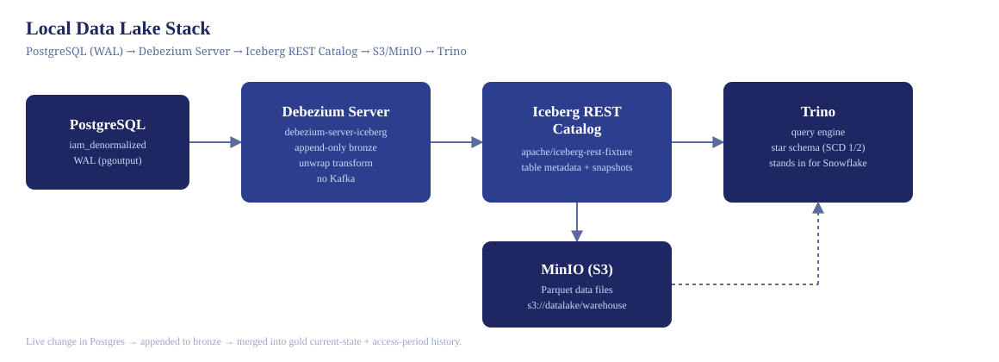
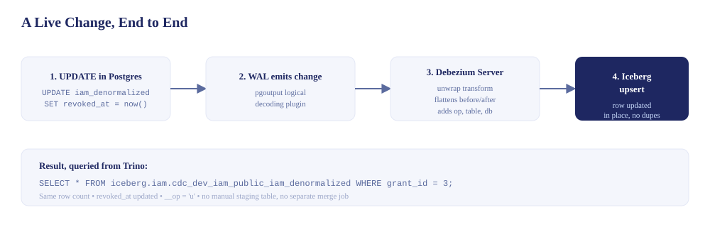

# Local Data Lake Schema Test Environment

A local stack for validating the **star schema, SCD Type-1/Type-2 logic,
columnar table design, and live CDC capture** before touching the client's
real infrastructure.

## What's in here

| Component | Role | Stands in for |
|---|---|---|
| `postgres` | Source OLTP database with sample IAM data | Client's PostgreSQL |
| `minio` | S3-compatible object storage | AWS S3 |
| `iceberg-rest` | Apache Iceberg REST catalog (table metadata/versioning) — `apache/iceberg-rest-fixture`, the official Apache Iceberg reference image | Snowflake's internal table format handling |
| `trino` | Columnar SQL query engine — supports `MERGE INTO`, partitioning, ANSI SQL | Snowflake's query engine |
| `debezium-server` | Captures Postgres WAL changes and appends them to an immutable bronze log — `ghcr.io/memiiso/debezium-server-iceberg` | The real CDC + landing layer proposed for the client |
| `echo-receiver` | HTTP endpoint that logs incoming CDC events | Optional — kept from earlier debugging, not required for the current pipeline |

Apache Iceberg is the closest open equivalent to how Snowflake actually
manages tables under the hood, and Snowflake natively supports querying
Iceberg tables — so schema/logic validated here should translate cleanly.



**Status: bronze/gold pipeline working end-to-end, idempotently.** The
schema, SCD merge logic, and CDC capture are all validated — and following
external review, the CDC landing layer was corrected from an upsert-only
table (which silently discarded history) to a proper **bronze/gold split**:
Debezium appends every change to an immutable bronze log, and a
watermark-tracked, idempotent merge derives the gold current-state and
history tables from it. Verified end to end: a live Postgres `UPDATE`
appends to bronze without overwriting anything, and re-running the gold
merge with no new events leaves both gold tables provably unchanged.

## 1. Start the stack

```bash
docker compose up -d
```

Wait ~30 seconds for health checks to pass. Verify:
- MinIO console: http://localhost:9001 (minioadmin / minioadmin) — you should see a `datalake` bucket
- Trino UI: http://localhost:8080
- Debezium Server logs: `docker logs -f dl_debezium_server` — should reach `"Processing messages"` with no errors

## 2. Connect a SQL client

**To Trino** (star schema / Iceberg tables): use the Trino CLI (`docker exec -it dl_trino trino`) or DBeaver with the Trino driver, JDBC URL `jdbc:trino://localhost:8080/iceberg/iam?user=dbeaver` (any username works — no real auth configured).

**To Postgres directly** (source data, needed to trigger live CDC events): a separate DBeaver connection — host `localhost`, port `5432`, database `iam_source`, user `iam_user`, password `iam_pass`. Running `UPDATE`/`DELETE` statements here is what Debezium actually watches.

## 3. Build the star schema

Run the contents of `lakehouse-sql/01_star_schema.sql` in your SQL client
against Trino. This creates `dim_user`, `dim_role`, `dim_resource`,
`fact_access_grant` (Type 1) and `fact_access_grant_history` (Type 2) as
Iceberg tables.

**Run it as individual statements, not as a full script** — see
`TROUBLESHOOTING.md` for why DBeaver's "Execute Script" mode has been
unreliable with these files.

## 4. Load the day-2 delta and test SCD merge logic

The Postgres source (`postgres-init/01_schema.sql`) seeds:
- `iam_denormalized` — day-1 state (5 grants)
- `iam_denormalized_day2_delta` — day-2 changes (1 update/revoke, 1 new grant, 1 hard delete)

Load the delta into `iceberg.iam.stg_delta` (see `02_merge_delta.sql` for
the staging table DDL), either via Trino's Postgres catalog federation
(`INSERT INTO iceberg.iam.stg_delta SELECT * FROM postgres.public.iam_denormalized_day2_delta`)
or manually.

Then run `lakehouse-sql/02_merge_delta.sql`. It applies both:
- **Type 1** merge into `fact_access_grant` (overwrite — current state only)
- **Type 2** merge into `fact_access_grant_history` (close old row, insert new versioned row)

The sanity-check queries at the bottom demonstrate exactly the kind of
point-in-time query ("what access existed as of Feb 1") that the history
table needs to support for the client.

**Note:** this step validates the Type 1/Type 2 merge *logic* against a
manually staged, synthetic delta — useful for proving the SQL is correct
in isolation. Section 5 below replaces the manual staging with the real
thing: the same merge pattern, sourced from Debezium's live, append-only
bronze log instead of a hand-loaded file.

**Important:** load day-1 base data into `fact_access_grant` /
`fact_access_grant_history` *before* running the merge, or you'll be
merging against an empty table. See `TROUBLESHOOTING.md` for the exact
symptom this produces if skipped.

## 5. Debezium: live CDC capture, bronze/gold architecture

Debezium Server watches `public.iam_denormalized` via PostgreSQL logical
replication (the `pgoutput` plugin — no extra Postgres extension needed)
and emits a change event for every insert/update/delete, including hard
deletes, independent of any `updated_at` column discipline.

**This pipeline uses a bronze/gold split, not a single upsert table.** An
earlier version wrote CDC events directly into an Iceberg table via
`upsert=true` — that proved the CDC connectivity worked, but an upsert
*replaces* the previous row, so it could not actually answer "what access
did this user have as of a given date?" External review of this project
correctly flagged that as the central gap: the live pipeline was
overwriting the very history it was meant to preserve.

**The fix:**

| Layer | Table | Write mode | Purpose |
|---|---|---|---|
| Bronze | `bronze_dev_iam_public_iam_denormalized` | **Append-only** (`upsert=false`) | Immutable log of every CDC event, including deletes. Never overwritten. |
| Gold | `fact_access_grant` (Type 1), `fact_access_grant_history` (Type 2) | Derived via `lakehouse-sql/03_bronze_to_gold.sql` | Current-state and effective-dated history, rebuilt from bronze |

Debezium now only ever **appends** to bronze. The gold tables are derived
from that permanent log by a separate, idempotent merge script — the same
question the reviewer asked ("where does history come from if the live
pipeline overwrites changes?") now has a real answer: **from bronze, which
is never overwritten.**

**Try it — this proves the whole chain, including that history is preserved:**
```sql
-- against the direct Postgres connection, not Trino
UPDATE iam_denormalized SET revoked_at = now(), updated_at = now() WHERE grant_id = 2;
```

Wait a few seconds, then confirm bronze got a **new row**, not an overwrite:
```sql
SELECT grant_id, __op, __source_ts_ns
FROM iceberg.iam.bronze_dev_iam_public_iam_denormalized
WHERE grant_id = 2 ORDER BY __source_ts_ns;
```
You should see **two rows** — the original snapshot (`__op = 'r'`) and the
new update (`__op = 'u'`), both present.

Then run `lakehouse-sql/03_bronze_to_gold.sql` and check:
```sql
SELECT * FROM iceberg.iam.fact_access_grant_history WHERE grant_id = 2 ORDER BY effective_start;
```
You should see **two versions** — the original closed out
(`is_current = false`, `effective_end` set) and the new one current — both
derived from the real, permanent bronze log.



### Idempotency

`03_bronze_to_gold.sql` tracks progress via a `gold_merge_watermark` table,
so it can be safely re-run at any time — new bronze events since the last
run are picked up, and if there are none, the script is a true no-op. This
was verified directly: running the merge twice in a row with no new bronze
events left both gold tables' row counts exactly unchanged. After every
run, this must return zero rows:
```sql
SELECT grant_id, COUNT(*) AS current_version_count
FROM iceberg.iam.fact_access_grant_history
WHERE is_current
GROUP BY grant_id
HAVING COUNT(*) > 1;
```

### How the S3/Iceberg sink question got resolved

This took real trial and error, documented in full in `TROUBLESHOOTING.md`.
The short version:

1. **Stock `debezium/server` doesn't ship an S3 or Iceberg sink** — its
   bundled sinks are Kafka, Pulsar, Kinesis, Redis, HTTP, etc., but not
   S3/Iceberg, in the version tags actually available on Docker Hub.
2. **`ghcr.io/memiiso/debezium-server-iceberg`** is a community project
   (now referenced directly in Debezium's own official docs as the
   supported way to get an Iceberg sink) that writes CDC events straight
   into Iceberg tables — no Kafka, no S3-JSON intermediate step.
3. That surfaced two more issues, both now fixed:
   - The default table **format-version 3** wasn't supported by
     `tabulario/iceberg-rest` (stale, hasn't been updated in over a year).
     Swapped to **`apache/iceberg-rest-fixture`**, the official Apache
     Iceberg project's own reference image, which does support v3.
   - The AWS S3 client needs an explicit **region** even though MinIO
     ignores it — added `AWS_REGION=us-east-1`.

### REPLICA IDENTITY note

`iam_denormalized` currently has `REPLICA IDENTITY DEFAULT`, so
update/delete events only carry previous values for primary-key columns,
not the full old row. For IAM data where "what changed" matters for audit
purposes, consider:
```sql
ALTER TABLE iam_denormalized REPLICA IDENTITY FULL;
```

## 6. What to actually validate here

- Does the star schema (flattened dims + fact) hold up against the real
  denormalized IAM source, or does it reveal a normalization the client's
  data actually needs?
- Does the Type 1 / Type 2 merge logic correctly handle all three delta
  operations (create/update/delete), including the hard-delete case?
- Does partitioning by `updated_at`/`effective_start` behave sensibly for
  the query patterns you expect (e.g., point-in-time lookups, "who currently
  has access to X")?
- Does Debezium's WAL-based capture actually catch changes a batch/
  `updated_at`-filtered query would miss? (Confirmed yes, for hard deletes.)
- Does the bronze log genuinely preserve every change as a separate,
  immutable row rather than overwriting? (Confirmed yes — a live Postgres
  `UPDATE` produces a new bronze row alongside the original, never
  replacing it.)
- Is the bronze-to-gold merge idempotent and free of duplicate current
  versions? (Confirmed yes — re-running the merge with no new bronze
  events leaves gold table row counts unchanged, and the
  duplicate-current-version check returns zero rows.)

## Known limitations (documented, not yet built)

Following external review, these are named explicitly rather than left
implicit — some are appropriate to address before a client-facing demo,
others are real production considerations intentionally out of scope for
this local proof of concept:

- **Day-1 seed data isn't a clean chronological scenario** —
  `postgres-init/01_schema.sql` seeds some grants with revoke/delete
  dates already in the past relative to the "day 1" snapshot. Fine for
  exercising the merge logic, but a cleaner sequential scenario (grant →
  revoke → new grant → delete, each as a distinct dated step) would be
  easier to walk a client through.
- **Record-level vs. access-level change conflation** — the current
  history table versions the whole grant row on any change (e.g., a
  `user_email` correction creates a new history version even though
  access itself didn't change). A production model should distinguish
  `access_start_at`/`access_end_at` from `source_changed_at`.
- **Single grant-path assumption** — the schema assumes one `grant_id`
  maps directly to one user/role/resource. Real IAM systems often involve
  group membership, role inheritance, and policy evaluation; whether that
  matters here depends on the client's actual access model.
- **Bitemporal modeling** — retroactive corrections (a change entered
  today with an effective date in the past) aren't handled; the model
  assumes `source_changed_at` and business-effective time are the same.
- **Delete semantics** — deletes currently close the access period
  without inserting an explicit tombstone row; `is_deleted` in the
  history table is populated but not the primary signal. Worth a single,
  explicit decision (interval model vs. version model) before production.
- **Two-step gold merge isn't transactionally atomic** — if the insert
  step failed after the close-out step succeeded, a grant could be left
  with no current version. A production implementation on Snowflake
  should use a transactional MERGE or task, not two separate statements.

## Not covered here (intentionally)

- Environment isolation — this is a single local sandbox
- Snowflake-specific features (Hybrid Tables, clustering keys, exact SQL
  dialect quirks, transactional guarantees) — this environment validates
  the dimensional model, temporal-query semantics, and CDC concepts using
  open table formats; Snowflake-specific behavior requires separate
  validation directly in Snowflake, including a real **free trial
  account** (cloud-only, 30 days) for anything DDL- or merge-specific

## Troubleshooting

See `TROUBLESHOOTING.md` for real issues hit setting this up — S3
path-style access, smart-quote corruption, DBeaver script-parsing quirks,
Debezium image tags/config paths, the missing-S3-sink dead end, the
Iceberg format-version mismatch, the AWS region requirement, and the
upsert-vs-append history bug — and how each was actually resolved.

## Tear down

```bash
docker compose down -v   # -v also removes the local data volumes
```
