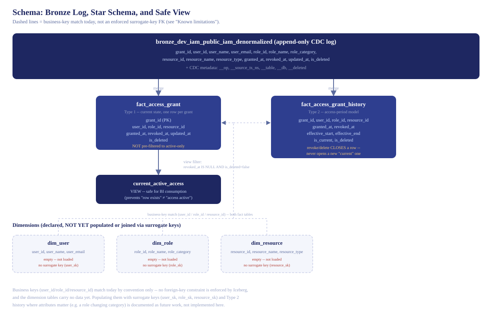
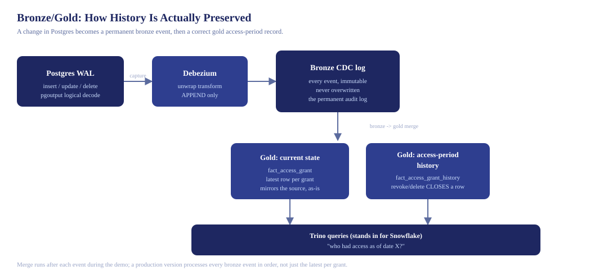

# Local Data Lake Schema Test Environment

A local stack for validating the **star schema, SCD Type-1/Type-2 logic,
columnar table design, and live CDC capture** before touching the client's
real infrastructure.

## What's in here

| Component | Role | Stands in for |
|---|---|---|
| `postgres` | Source OLTP database with sample IAM data | Client's PostgreSQL |
| `minio` | S3-compatible object storage | AWS S3 |
| `iceberg-rest` | Apache Iceberg REST catalog (table metadata/versioning) — `apache/iceberg-rest-fixture`, the official Apache Iceberg reference image | Snowflake's internal table format handling |
| `trino` | Columnar SQL query engine — supports `MERGE INTO`, partitioning, ANSI SQL | Snowflake's query engine |
| `debezium-server` | Captures Postgres WAL changes and appends them to an immutable bronze log — `ghcr.io/memiiso/debezium-server-iceberg` | The real CDC + landing layer proposed for the client |
| `echo-receiver` | HTTP endpoint that logs incoming CDC events | Optional — kept from earlier debugging, not required for the current pipeline |

Apache Iceberg is an open table format Snowflake natively supports
querying, which is why it's used here as the local stand-in for
Snowflake -- but this environment validates the **dimensional model,
temporal-query semantics, and CDC concepts**, not Snowflake itself.
Snowflake-specific behavior (exact SQL dialect, clustering keys,
transactional guarantees, streams/tasks) requires separate validation
directly in Snowflake -- see "Not covered here" below.

<a href="https://raw.githubusercontent.com/pramalin/datalake-local-test/master/docs/images/architecture.svg" target="_blank">
  
</a>

<p><em>Click the diagram to open the full-size SVG (Ctrl/Cmd + click for a new tab).</em></p>

**Status: bronze/gold pipeline working end-to-end, idempotently.** The
schema, SCD merge logic, and CDC capture are all validated — and following
external review, the CDC landing layer was corrected from an upsert-only
table (which silently discarded history) to a proper **bronze/gold split**:
Debezium appends every change to an immutable bronze log, and a
watermark-tracked, idempotent merge derives the gold current-state and
history tables from it. Verified end to end: a live Postgres `UPDATE`
appends to bronze without overwriting anything, and re-running the gold
merge with no new events leaves both gold tables provably unchanged.

## Source schema: what Debezium is actually watching

Everything downstream starts from a single Postgres table,
`iam_denormalized` (`postgres-init/01_schema.sql`) — deliberately shaped
to match the client's **actual current OLTP representation**: flat,
denormalized (names inline, not just IDs), and with no history of its
own. This is the entire reason the project exists — the client can
answer "who has access right now," but this table alone cannot answer
"who had access as of a past date," because a normal `UPDATE` or
`DELETE` here simply overwrites or removes the row, with nothing kept
behind.

| Column | Type | Constraint | Notes |
|---|---|---|---|
| `grant_id` | `BIGINT` | `PRIMARY KEY` | one row per access grant |
| `user_id` | `BIGINT` | `NOT NULL` | business key, not a surrogate key |
| `user_name` | `TEXT` | `NOT NULL` | denormalized, not joined from a users table |
| `user_email` | `TEXT` | `NOT NULL` | denormalized |
| `role_id` | `BIGINT` | `NOT NULL` | business key |
| `role_name` | `TEXT` | `NOT NULL` | denormalized |
| `role_category` | `TEXT` | nullable | e.g. Privileged / Standard / Read-Only |
| `resource_id` | `BIGINT` | `NOT NULL` | business key |
| `resource_name` | `TEXT` | `NOT NULL` | denormalized |
| `resource_type` | `TEXT` | nullable | e.g. Database / Service / Storage |
| `granted_at` | `TIMESTAMP` | `NOT NULL` | when access started |
| `revoked_at` | `TIMESTAMP` | nullable | `NULL` = still active |
| `updated_at` | `TIMESTAMP` | `NOT NULL`, default `now()` | last write to this row |
| `is_deleted` | `BOOLEAN` | `NOT NULL`, default `false` | app-level soft-delete flag -- **separate from a hard `DELETE`**, which removes the row entirely and is what the demo's offboarding event actually does |

**Two things about this table matter more than they might look:**

1. **`REPLICA IDENTITY` is left at Postgres's default** (`DEFAULT`,
   never explicitly changed) — deliberately, to demonstrate a real
   constraint rather than configure it away. Under `DEFAULT`, a
   `DELETE`'s replication payload carries only `grant_id` (the primary
   key) — none of the other columns. This is *why* a hard delete has no
   usable business timestamp and has to fall back to Debezium's capture
   time (see section 5) — it's a direct, visible consequence of this
   table's replication config, not an abstract caveat.
2. **`is_deleted` existing as a column doesn't mean it's how deletions
   happen in this demo.** The narrative's offboarding event
   (`demo_events/04_offboard_contractor.sql`) issues a real `DELETE`,
   not an `UPDATE ... SET is_deleted = true`. Both are realistic --
   different source systems soft-delete or hard-delete -- but this
   project specifically exercises the hard-delete path, since that's
   the one a naive batch/`updated_at`-filtered extract would silently
   miss entirely.

Every column here reappears in the bronze log
(`bronze_dev_iam_public_iam_denormalized`) unchanged, plus Debezium's
own CDC metadata (`__op`, `__source_ts_ns`, `__table`, `__db`,
`__deleted`) — see the schema diagram in section 3 for how it flows
from there into gold.

## 1. Start the stack

```bash
docker compose up -d
```

Wait ~30 seconds for health checks to pass. Verify:
- MinIO console: http://localhost:9001 (minioadmin / minioadmin) — you should see a `datalake` bucket
- Trino UI: http://localhost:8080
- Debezium Server logs: `docker logs -f dl_debezium_server` — should reach `"Processing messages"` with no errors

## 2. Connect a SQL client

**To Trino** (star schema / Iceberg tables): use the Trino CLI (`docker exec -it dl_trino trino`) or DBeaver with the Trino driver, JDBC URL `jdbc:trino://localhost:8080/iceberg/iam?user=dbeaver` (any username works — no real auth configured).

**To Postgres directly** (source data, needed to trigger live CDC events): a separate DBeaver connection — host `localhost`, port `5432`, database `iam_source`, user `iam_user`, password `iam_pass`. Running `UPDATE`/`DELETE` statements here is what Debezium actually watches.

## 3. Build the star schema

Run the contents of `lakehouse-sql/01_star_schema.sql` in your SQL client
against Trino. This creates `dim_user`, `dim_role`, `dim_resource`,
`fact_access_grant` (Type 1), `fact_access_grant_history` (Type 2), and
the `current_active_access` view as Iceberg tables.

**Run it as individual statements, not as a full script** — see
`TROUBLESHOOTING.md` for why DBeaver's "Execute Script" mode has been
unreliable with these files.

### Schema at a glance

<a href="https://raw.githubusercontent.com/pramalin/datalake-local-test/master/docs/images/schema_er.svg" target="_blank">
  
</a>

<p><em>Click the diagram to open the full-size SVG (Ctrl/Cmd + click for a new tab).</em></p>

**bronze_dev_iam_public_iam_denormalized** — the append-only CDC log
Debezium writes to (see section 5). Denormalized: it carries user/role/
resource *names*, not just IDs, matching the client's actual source
table shape. Never queried directly by consumers — it's the permanent
raw record everything else is derived from.

**fact_access_grant** (Type 1) — current-state mirror of the source,
one row per `grant_id`. Includes revoked grants (`revoked_at` populated)
and excludes hard-deleted ones (the row is gone entirely). **Not
pre-filtered to active access** — see `current_active_access` below.

**fact_access_grant_history** (Type 2) — the access-period model this
whole project exists to prove out. A row spans `effective_start` to
`effective_end` for as long as access was actually granted. A
revocation or hard delete **closes** the row (`effective_end` set,
`is_current = false`) and does **not** open a new "current" row — see
section 5 and `TROUBLESHOOTING.md` issue #18 for why that distinction
matters and what happens if you get it wrong.

**current_active_access** (view) — `fact_access_grant` pre-filtered to
`revoked_at IS NULL AND is_deleted = false`. Exists so a BI consumer
querying "who has access" can't accidentally mistake "a row exists" for
"access is currently active."

**dim_user / dim_role / dim_resource** — declared but **intentionally
not populated or joined via surrogate keys** in this demo. `user_id`,
`role_id`, and `resource_id` are business keys, matched by convention
only — Iceberg doesn't enforce a foreign-key constraint, and nothing
currently loads these tables. A production version would populate them,
add surrogate keys (`user_sk`/`role_sk`/`resource_sk`), and decide which
dimension attributes need their own Type 2 history (e.g. a role's
category changing over time) — see "Known limitations" below.

## 4. Replay a clean historical scenario and answer real business questions

The Postgres source (`postgres-init/01_schema.sql`) now seeds a genuinely
clean day-1 state: three grants (Alice/Admin, Bob/Analyst, Carla/Admin),
all active, dated Jan 5-7 -- nothing revoked or deleted is baked in. Every
later event is demonstrated as a real, live change, not a pre-staged file.

**Recommended: run it via the scripts, not manually.** Running SQL one
statement at a time by hand (via DBeaver) is what produced most of the
issues in `TROUBLESHOOTING.md` -- wrong connection tab, partial script
execution, and so on. `scripts/` drives the whole thing through `psql`
and the Trino CLI instead, non-interactively:

```bash
chmod +x scripts/*.sh
./scripts/run-full-demo.sh
```

**See [`docs/sample-demo-run.md`](docs/sample-demo-run.md) for a real,
annotated log of this script running end to end** — every phase
explained, including exactly what each row-count change and `PASS` line
actually proves. Worth reading if you want to verify the claims in this
README rather than just take them on faith.

This resets the environment, builds the star schema, seeds gold from the
day-1 bronze snapshot, replays all five narrative events below (merging
gold after **each one** -- not batched, see the comment in
`scripts/01-replay-narrative.sh` for why that matters), then runs the
acceptance queries and proves idempotency, failing loudly
(`exit 1`) if a re-run ever changes gold's row counts.

The five events (`demo_events/01_*.sql` through `05_*.sql`):

| Date | Event |
|---|---|
| Feb 1 | Carla's Admin access to billing-api is revoked |
| Feb 10 | Alice is additionally granted Auditor access to audit-logs |
| Feb 15 | A contractor is granted temporary access to staging-db |
| Mar 1 | The contractor is offboarded -- their grant is **hard deleted** |
| Mar 15 | Alice's original Admin access is revoked; a new hire is granted access |

**"Mar 1" above is a scenario label, not a reproducible business
timestamp.** Every OTHER date in this table is real -- it's set directly
in the data (`revoked_at`/`updated_at`) and the gold merge uses it
exactly. The hard-delete row is the one exception: Postgres never sends
a business-level "deleted at" value for a hard delete, so that event's
`effective_end` reflects whenever you actually ran the demo, not March 1.
See section 5's note on delete-timestamp handling.

`lakehouse-sql/04_acceptance_queries.sql` answers real questions an
auditor might ask, such as:

- What active access did Alice have on January 31 (before any of this happened)?
- Who had access to prod-db-01 on February 15?
- Did the contractor's access exist on February 20?
- When was the contractor's access removed, and was it a revoke or a hard delete?

The queries also create `iceberg.iam.current_active_access`, a view over
`fact_access_grant` that pre-applies the `revoked_at IS NULL AND
is_deleted = false` filter -- safer for downstream BI consumers than
querying `fact_access_grant` directly and risking "a row exists" being
mistaken for "access is currently active."

Because effective dating uses the *business* timestamps in the data
(`granted_at`/`revoked_at`/`updated_at`) for creates/updates, these
queries give correct historical answers regardless of when during the
demo you actually replay the narrative. **Hard deletes are the one
exception** -- see the note on delete timestamps in section 5.

**To run it manually instead** (e.g. to inspect intermediate state):
build the star schema (section 3), then run `lakehouse-sql/03_bronze_to_gold.sql`
once to seed gold from the day-1 snapshot, then apply each
`demo_events/*.sql` file to Postgres one at a time, re-running
`03_bronze_to_gold.sql` after each one.

## 5. Debezium: live CDC capture, bronze/gold architecture

Debezium Server watches `public.iam_denormalized` via PostgreSQL logical
replication (the `pgoutput` plugin — no extra Postgres extension needed)
and emits a change event for every insert/update/delete, including hard
deletes, independent of any `updated_at` column discipline.

**This pipeline uses a bronze/gold split, not a single upsert table.** An
earlier version wrote CDC events directly into an Iceberg table via
`upsert=true` — that proved the CDC connectivity worked, but an upsert
*replaces* the previous row, so it could not actually answer "what access
did this user have as of a given date?" External review of this project
correctly flagged that as the central gap: the live pipeline was
overwriting the very history it was meant to preserve.

**The fix:**

| Layer | Table | Write mode | Purpose |
|---|---|---|---|
| Bronze | `bronze_dev_iam_public_iam_denormalized` | **Append-only** (`upsert=false`) | Immutable log of every CDC event, including deletes. Never overwritten. |
| Gold | `fact_access_grant` (Type 1), `fact_access_grant_history` (Type 2) | Derived via `lakehouse-sql/03_bronze_to_gold.sql` | Current-state and access-period history. In this demo, incrementally derived from bronze -- merged after each narrative event. A production version must process every bronze event in source order for history (see "Known limitations"). |

Debezium now only ever **appends** to bronze. The gold tables are 
from that permanent log by a separate, idempotent merge script — the same
question the reviewer asked ("where does history come from if the live
pipeline overwrites changes?") now has a real answer: **from bronze, which
is never overwritten.**

**Try it — a quick single-event sanity check** (the full narrative walkthrough with real business questions is in section 4):
```sql
-- against the direct Postgres connection, not Trino
-- Bob's role is upgraded (NOT a revocation -- revoked_at stays NULL)
UPDATE iam_denormalized SET role_id = 1, role_name = 'Admin', role_category = 'Privileged', updated_at = now() WHERE grant_id = 2;
```

Wait a few seconds, then confirm bronze got a **new row**, not an overwrite:
```sql
SELECT grant_id, __op, __source_ts_ns
FROM iceberg.iam.bronze_dev_iam_public_iam_denormalized
WHERE grant_id = 2 ORDER BY __source_ts_ns;
```
You should see **two rows** — the original snapshot (`__op = 'r'`) and the
new update (`__op = 'u'`), both present.

Then run `lakehouse-sql/03_bronze_to_gold.sql` and check:
```sql
SELECT * FROM iceberg.iam.fact_access_grant_history WHERE grant_id = 2 ORDER BY effective_start;
```
You should see **two versions** — the original (Analyst) closed out
(`is_current = false`, `effective_end` set) and the new one (Admin)
current — both derived from the real, permanent bronze log. This is a
genuine record update, not a revocation, so it correctly opens a new
current row. **A revocation behaves differently and deliberately does
NOT open a new row** — see section 4's Q9 regression test, which checks
exactly that.

<a href="https://raw.githubusercontent.com/pramalin/datalake-local-test/master/docs/images/cdc-bronze-gold-flow.svg" target="_blank">
  
</a>

<p><em>Click the diagram to open the full-size SVG (Ctrl/Cmd + click for a new tab).</em></p>

### Idempotency

`03_bronze_to_gold.sql` tracks progress via a `gold_merge_watermark` table,
so it can be safely re-run at any time — new bronze events since the last
run are picked up, and if there are none, the script is a true no-op. This
was verified directly: running the merge twice in a row with no new bronze
events left both gold tables' row counts exactly unchanged. After every
run, this must return zero rows:
```sql
SELECT grant_id, COUNT(*) AS current_version_count
FROM iceberg.iam.fact_access_grant_history
WHERE is_current
GROUP BY grant_id
HAVING COUNT(*) > 1;
```

### How the S3/Iceberg sink question got resolved

This took real trial and error, documented in full in `TROUBLESHOOTING.md`.
The short version:

1. **Stock `debezium/server` doesn't ship an S3 or Iceberg sink** — its
   bundled sinks are Kafka, Pulsar, Kinesis, Redis, HTTP, etc., but not
   S3/Iceberg, in the version tags actually available on Docker Hub.
2. **`ghcr.io/memiiso/debezium-server-iceberg`** is a community project
   (now referenced directly in Debezium's own official docs as the
   supported way to get an Iceberg sink) that writes CDC events straight
   into Iceberg tables — no Kafka, no S3-JSON intermediate step.
3. That surfaced two more issues, both now fixed:
   - The default table **format-version 3** wasn't supported by
     `tabulario/iceberg-rest` (stale, hasn't been updated in over a year).
     Swapped to **`apache/iceberg-rest-fixture`**, the official Apache
     Iceberg project's own reference image, which does support v3.
   - The AWS S3 client needs an explicit **region** even though MinIO
     ignores it — added `AWS_REGION=us-east-1`.

### REPLICA IDENTITY note and delete-timestamp handling

`iam_denormalized` currently has `REPLICA IDENTITY DEFAULT`, so
update/delete events only carry previous values for primary-key columns,
not the full old row. This isn't just a theoretical gap -- it caused a
real bug, caught by the automated acceptance tests
(`scripts/02-verify.sh`): a hard-deleted grant's closing `effective_end`
was being derived from `updated_at`, which is `NULL` on a delete under
`DEFAULT` identity, and that `NULL` was rendering as Unix epoch
(1970-01-01) instead of a real date -- which made the deleted grant's
history row look like it had "expired before it began," silently hiding
real historical access from any "as of" query that should have found it.

**The fix** (in `lakehouse-sql/03_bronze_to_gold.sql`): for delete events
specifically, effective-dating falls back to Debezium's own capture
timestamp (`__source_ts_ns`) rather than the row's `updated_at`. This is
a deliberate choice, not a full solution -- **hard deletes have no
business-level "deleted at" timestamp at all**, since Postgres never
records one. `REPLICA IDENTITY FULL` would give deletes the full "before"
row, but that row's `updated_at` reflects when the grant was *last
changed before* deletion, not when it was *deleted* -- it would not have
fixed this. A production system for a regulated environment should treat
this explicitly: either add an application-level `deleted_at` audit
column, or explicitly document (as here) that delete effective-dating
uses capture time, not business time.

For IAM data where "what changed" matters for audit purposes on
*updates* (not deletes), consider:
```sql
ALTER TABLE iam_denormalized REPLICA IDENTITY FULL;
```

## 6. What to actually validate here

- Does the star schema (flattened dims + fact) hold up against the real
  denormalized IAM source, or does it reveal a normalization the client's
  data actually needs?
- Does the Type 1 / Type 2 merge logic correctly handle all three delta
  operations (create/update/delete), including the hard-delete case?
- Does partitioning by `updated_at`/`effective_start` behave sensibly for
  the query patterns you expect (e.g., point-in-time lookups, "who currently
  has access to X")?
- Does Debezium's WAL-based capture actually catch changes a batch/
  `updated_at`-filtered query would miss? (Confirmed yes, for hard deletes.)
- Does the bronze log genuinely preserve every change as a separate,
  immutable row rather than overwriting? (Confirmed yes — a live Postgres
  `UPDATE` produces a new bronze row alongside the original, never
  replacing it.)
- Is the bronze-to-gold merge idempotent and free of duplicate current
  versions? (Confirmed yes — re-running the merge with no new bronze
  events leaves gold table row counts unchanged, and the
  duplicate-current-version check returns zero rows.)
- Are the actual business ANSWERS correct, not just stable? These are
  different questions -- a merge can be perfectly idempotent and stably
  wrong. `scripts/03-assert-business-answers.sh` asserts specific,
  correct answers (including a direct regression test for the
  revocation bug in TROUBLESHOOTING.md issue #18), not just row-count
  stability. (Confirmed yes, as of the access-period model fix.) **Note:**
  these assertions -- including the exact "6 history rows" check -- are
  a **demo acceptance test tied to this specific narrative**, not a
  generic pipeline invariant; a different scenario would correctly
  produce a different row count.

## Known limitations (documented, not yet built)

Following external review, these are named explicitly rather than left
implicit — some are appropriate to address before a client-facing demo,
others are real production considerations intentionally out of scope for
this local proof of concept:

- **Record-level vs. access-level change conflation** — the current
  history table versions the whole grant row on any change (e.g., a
  `user_email` correction creates a new history version even though
  access itself didn't change). A production model should distinguish
  `access_start_at`/`access_end_at` from `source_changed_at`.
- **Single grant-path assumption** — the schema assumes one `grant_id`
  maps directly to one user/role/resource. Real IAM systems often involve
  group membership, role inheritance, and policy evaluation; whether that
  matters here depends on the client's actual access model.
- **Dimensions declared but not populated or connected via surrogate
  keys** — `dim_user`/`dim_role`/`dim_resource` exist as tables but
  nothing loads them; the fact tables join to them (conceptually) via
  business keys only, with no enforced foreign key and no surrogate key
  (`user_sk` etc.) at all. Acceptable for a minimal schema-shape demo;
  a production version needs both populated dimensions and a decision
  on which dimension attributes need their own Type 2 history (e.g. a
  role's category changing over time). See the schema diagram in
  section 3.
- **Bitemporal modeling** — retroactive corrections (a change entered
  today with an effective date in the past) aren't handled; the model
  assumes `source_changed_at` and business-effective time are the same.
  **This is not just theoretical**: hard deletes concretely demonstrate
  the gap, since they carry no business timestamp at all and fall back
  to capture time (see section 5's REPLICA IDENTITY note) -- a real,
  caught-by-testing instance of exactly this limitation. The assertion
  suite (`scripts/03-assert-business-answers.sh`) deliberately does not
  assert an exact business date for the delete case, for this reason.
- **Delete/revocation semantics -- resolved via the access-period model**:
  a revocation or hard delete both CLOSE the access-period row (setting
  `effective_end`) and neither opens a new "current" row -- an earlier
  version got this wrong for revocations specifically (see
  TROUBLESHOOTING.md issue #18). `is_deleted` on the closed row is now
  the reliable signal for "this ended because of a hard delete" versus
  "this ended because of a normal revocation."
- **Batch dedup can discard intermediate history events** — the
  bronze-to-gold merge keeps only the LATEST bronze event per `grant_id`
  within a single run (needed for idempotency). If multiple
  history-relevant events land for the same grant between merge runs,
  the intermediate ones are silently dropped rather than each producing
  their own history interval. The demo scripts avoid this by merging
  after every single event (`scripts/01-replay-narrative.sh`), but a
  production version should process every event in order for history --
  current-state can safely use latest-per-grant, history cannot.
- **Timestamp-based watermark is not a safe cursor at scale** — the
  gold merge advances using `__source_ts_ns > last_processed_ts`, a
  nanosecond capture timestamp. This can skip events if two changes
  share a timestamp or arrive out of order. A production cursor should
  use the Postgres LSN plus a transaction/sequence order, or at minimum
  a composite event key, not a bare timestamp.
- **Two-step gold merge isn't transactionally atomic** — if the insert
  step failed after the close-out step succeeded, a grant could be left
  with no current version. A production implementation on Snowflake
  should use a transactional MERGE or task, not two separate statements.

## Not covered here (intentionally)

- Environment isolation — this is a single local sandbox
- Snowflake-specific features (Hybrid Tables, clustering keys, exact SQL
  dialect quirks, transactional guarantees) — this environment validates
  the dimensional model, temporal-query semantics, and CDC concepts using
  open table formats; Snowflake-specific behavior requires separate
  validation directly in Snowflake, including a real **free trial
  account** (cloud-only, 30 days) for anything DDL- or merge-specific

## Troubleshooting

See `TROUBLESHOOTING.md` for real issues hit setting this up — S3
path-style access, smart-quote corruption, DBeaver script-parsing quirks,
Debezium image tags/config paths, the missing-S3-sink dead end, the
Iceberg format-version mismatch, the AWS region requirement, and the
upsert-vs-append history bug — and how each was actually resolved.

## Tear down

```bash
docker compose down -v   # -v also removes the local data volumes
```
